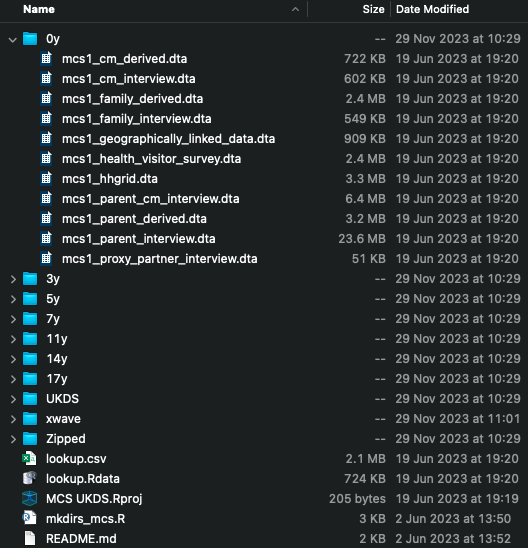

# Introduction

Longitudinal data represent a rich seam of information for use in quantitative research. Longitudinal data are often interesting in their own right - for instance, in capturing change over the life course - but can also be helpful instrumentally - for instance, to support causal inference, temporality being a key criterion for causality.

Longitudinal data are used in many scientific disciplines, and many longitudinal datasets now exist - see Louise Arseneault's [*Atlas of Longitudinal Datasets*](https://atlaslongitudinaldatasets.ac.uk/) for a comprehensive overview. The Centre for Longitudinal Studies (CLS) runs several cohort studies, including the 1958 ([National Child Development Study, NCDS](https://doi.org/10.1093/ije/dyi183)) and 1970 ([British Cohort Study, BCS70](https://doi.org/10.1093/ije/dyac148)) British birth cohorts, Next Steps ([formerly, the Longitudinal Study of Young People in England](https://doi.org/10.1093/ije/dyae152)), and the Millennium Cohort Study ([MCS](https://doi.org/10.1093/ije/dyu001)). Each is fabulously rich and collectively have been used - and continue to be used - [in thousands of research studies](https://www.bibliography.cls.ucl.ac.uk/). We'll use data from the NCDS and MCS in this course.

What perhaps distinguishes longitudinal data analysis from other types of data analysis is the efforts involved in preparing the data for analysis and in translating results into presentable formats (e.g., tables and plots). Longitudinal data usually have complex data structures, with data split across multiple files, and data collection 'sweeps' frequently accompanied with changes to documentation, metadata or variable coding. Even though the same construct may have been measured in multiple sweeps, it is often the case that variable names do not follow a common schema nor use consistent coding over time. Especially for older studies, metadata standards may have been lacking in earlier sweeps. For instance, variable names might not be descriptive, have senseful variable or values labels, or use consistent missing data codes (the variable `n622` in the NCDS records a cohort member's sex, for example). Early survey questionnaires may only be available as scanned images, rather than in machine-readable formats, and not annotated with variable names. The upshot is that getting to grips with a longitudinal dataset can be a time-intensive task. An aim here is to show how `R` can make this process much easier.

Additional complexity arises from the presence of missing data, which is common in longitudinal data due to attrition (i.e., participants dropping out of the study over time) and item non-response (i.e., participants not answering specific questions), and requires careful handling during analysis: for instance, correctly identifying the target analysis sample, deriving non-response weights, and using multiple imputation. Moving between data preparation and analysis can require restructuring data - e.g., imputing data in wide format, but estimating regression models in long format. Further, coefficients from longitudinal regression models may not be of direct interest - instead, calculated quantities, such as marginal effects, may be. For instance, in growth curve modelling, where one models trajectories of an outcome over the life course, one may wish to determine a marginal effect at a specific age, rather than simply look at the coefficients, standard errors and confidence intervals for the intercept and slope terms (which depend on how the time variable is centered, in any case). To be done effectively and efficiently, each of these task requires programming skills that are not often taught.

By its very nature, some steps in LDA can be repetitive - for instance, one may want to repeat a regression at different follow-up sweeps or wish to clean a variable captured in several sweeps in the same way. Automating such tasks is important to reduce the risk of errors, as well as to save time. Learning how to do this can also increase the ambitiousness of one's research in general, even for applications that do not use longitudinal data - skills for 'repeating yourself' can be used to undertake Specification Curve Analysis ([Simonsohn et al., 2020](https://doi.org/10.1038/s41562-020-0912-z)), for example - a ['many models'](https://doi.org/10.31235/osf.io/azvs4) approach that requires specifying and running a universe of models.

## Purpose of the Course

This course introduces `R` for LDA, using data from two of CLS's cohort studies, the NCDS and MCS. The course is aimed at researchers who have some knowledge of `R`, and who have some experience of the aims of LDA. The focus is on the practical tasks involved in LDA, rather than the statistical theory of longitudinal regression modelling. Courses on regression modelling already exist ([Bristol's LEMMA course](https://www.bristol.ac.uk/cmm/learning/online-course/) is especially fine), but few courses focus on other aspects, which take up an inordinate amount of analysts' attention - a [New York Times article](https://archive.ph/QL2xO) reported over half of data scientists' time is spent on finding, cleaning and preparing data.

Specifically, over six interactive sessions, this course covers:

1.  An Introduction to `R` and the `tidyverse` for LDA
    -   Necessary `R` and `tidyverse` skills called on and developed further throughout the course
2.  Data Discovery
    -   Tools for finding relevant variables programmatically using `R`
3.  Munging Longitudinal Data
    -   Techniques for cleaning and restructuring longitudinal data efficiently
4.  Calculating Descriptive Statistics
    -   Methods for calculating descriptive statistics relevant for rigorous LDA
5.  Estimating, and Working With, Regression Models
    -   Methods for performing many model approaches and for post-estimation of LDA models
6.  Presenting Statistical Outputs
    -   Tools for creating publication-ready tables and plots from LDA results.

Throughout the course, we will use a running example of the association between cognitive ability in childhood/adolescence and body mass index (BMI) in adulthood. We use this example as cognitive ability and BMI are both measured in multiple sweeps in both the NCDS and MCS, and in various ways, allowing us to illustrate longitudinal data handling and analysis techniques.

## Coding Approach

When teaching `R`, one must decide upon an overall programming approach. This course uses the `tidyverse`, as developed by [Hadley Wickham and colleagues at RStudio (now Posit)](https://tidyverse.org/). The `tidyverse` is a collection of `R` packages that share a common design philosophy and so work together seamlessly. The `tidyverse` is also more straightforward to learn and to write code in than *Base `R`*, the collection of packages that come pre-installed with `R`. Basics of the `tidyverse` will be introduced in [Chapter @sec-intro_tidyverse], following with some important aspects of Base `R` ([Chapter @sec-background_r]).

## Datasets We Will Use

The NCDS is a cohort of 18,588 individuals born in mainland Great Britain in a single week of March 1958. Migrants to the UK, born in the same week, were later added to the cohort using school enrollment forms. Cohort members (or their parents) have been surveyed at birth, 7y, 11y, 16y, 23y, 33y, 42y, 46y, 50y, 55y and 62y, with a biomedical survey at 44y. The MCS is a cohort of 19,515 individuals born in the UK between September 2000 and January 2002. Cohort member (or their parents and even their older siblings) have been surveyed at 9 months, 3y, 5y, 7y, 11y, 14y, 17y and 23y. Most MCS families were recruited at 9 months but a minority (591 families) were recruited at 3y.

Combined, the NCDS and MCS reflect many of the issues and consideration that arise when working with longitudinal data. As discussed, as an older study, NCDS has issues around changing (and lacking, at least in earlier sweeps) metadata standards. On the other hand, MCS has data that are more consistently documented, making it more ripe for automation, but it also has [more complex data structures](https://cls-data.github.io/docs/mcs-data_structures.html) (e.g., containing cohort member-, family-, parent-, and parent x cohort member-level datasets), which can be tricky to work with.

[NCDS](http://doi.org/10.5255/UKDA-Series-2000032) and [MCS](http://doi.org/10.5255/UKDA-Series-2000031) data are available for free on the UK Data Service, but have to be downloaded by each data sweep, separately. To make working with the data easier, we have [produced](https://cls-data.github.io/docs/ncds-sweep_folders.html) [code](https://cls-data.github.io/docs/mcs-sweep_folders.html) to organise the data files (once downloaded) into a consistent directory structure with sub-directories for each study sweep, named by cohort members' age at data collection (see below). The code in this textbook assumes data are in Stata (`.dta`) format and organised as in

CLS has produced a [data handling guide](https://cls-data.github.io/docs/intro.html) for both studies, but a few things should be made clear now:

1.  The variable containing the unique cohort member identifier in the NCDS is called `NCDSID` or, in some datasets, `ncdsid`.
2.  The vast majority of NCDS datasets are *cohort member level* - i.e. have one row per cohort member.
3.  Individuals in the MCS are identified with a combination of two variables. For cohort members, this is `MCSID` (the family identifier) and `XCNUM00` (the within-family cohort member identifier) - `X` is a letter denoting sweep (e.g., `ACNUM00` in Sweep 1, `BCNUM00` in Sweep 2, etc.). `XCNUM00` equals 1 or 2, with 2 reserved for one of the two twins from a twin family. `MCSID` and `XCNUM00` persist across sweeps.
4.  Other MCS family members can be identified by combining the variables `MCSID` and `XPNUM00` - again, `X` a letter denoting sweep. `XPNUM00 < 100` for non-cohort members and `XPNUM00 = XCNUM00 * 100` for cohort members. Values are arbitrary and do not correspond to a specific relationship (e.g., `XPNUM00 = 1` is not necessarily a cohort member's mother). `MCSID` and `XPNUM00` persist across sweeps.
5.  Files in both the MCS and NCDS have rows for individuals who data was collected from. Cohort member files can be used to determine who responded (or, in some case, had proxy respondents for) in a specific sweep, though both studies also include longitudinal response files which provide response codes for each individual in each sweep
6.  Later sweeps of NCDS and all sweeps of MCS use consistent variable naming structures, with variable names prefixed with a stub indicating sweep. In the MCS, this is a letter denoting sweep (`A` in Sweep 1, `B` in Sweep 2, ..., `G` in Sweep 8). Similar variables share similar names across sweeps (e.g., `XCHTCM00` for height). MCS also uses a consistent file name rubric, which is of the form `mcs{sweep}_{respondent}_{type}.dta` - for instance, the Sweep 6, cohort member interview is in `mcs6_cm_interview.dta`.
7.  An exception to these rules is Sweep 8, where (as downloaded from the UKDS) the file paths also contains information information on age at follow-up (`mcs8_23y_cm_interview.dta`) and variables are in lower case. I have shared files removing this age and made variables upper case to make working programatically a little easier. Note, Wave 5 also contains deviation from the usual variable naming rubric.
8.  The `mcs[1-7]_parent_cm_interview.dta` files contain information from parents about their relationship with a cohort member. Both parents took this interview, so there may be multiple rows per individual cohort member. There were 'main' or shorter 'partner' interviews. Information on which interview a parent took is stored in the variable `XELIG00` (with `X` a letter denoting sweep). Note, who is interviewed each sweep depends differs. In this dataset, the variable `XPNUM00` holds the *parent's* PNUM, not the cohort member's.

## On AI

Before starting, a word on AI. Frontier LLMs are astonishingly capable at coding (full disclosure, I used the assistance of GitHub Copilot and ChatGPT when writing this book). Despite this, it is still worth learning how to code. LLMs make mistakes and without expertise, one will be unlikely to spot this. Mistakes are particularly likely with longitudinal data as documentation is often poor (e.g., variables not labelled correctly). Less prosaically, learning how to code is also learning a particularly way of thinking. Understanding algorithms can help with understanding particular statistical methods (e.g., the bootstrap, random forest) and it can help provide a sense of what is possible with data and the steps necessary to achieve a specific end.
