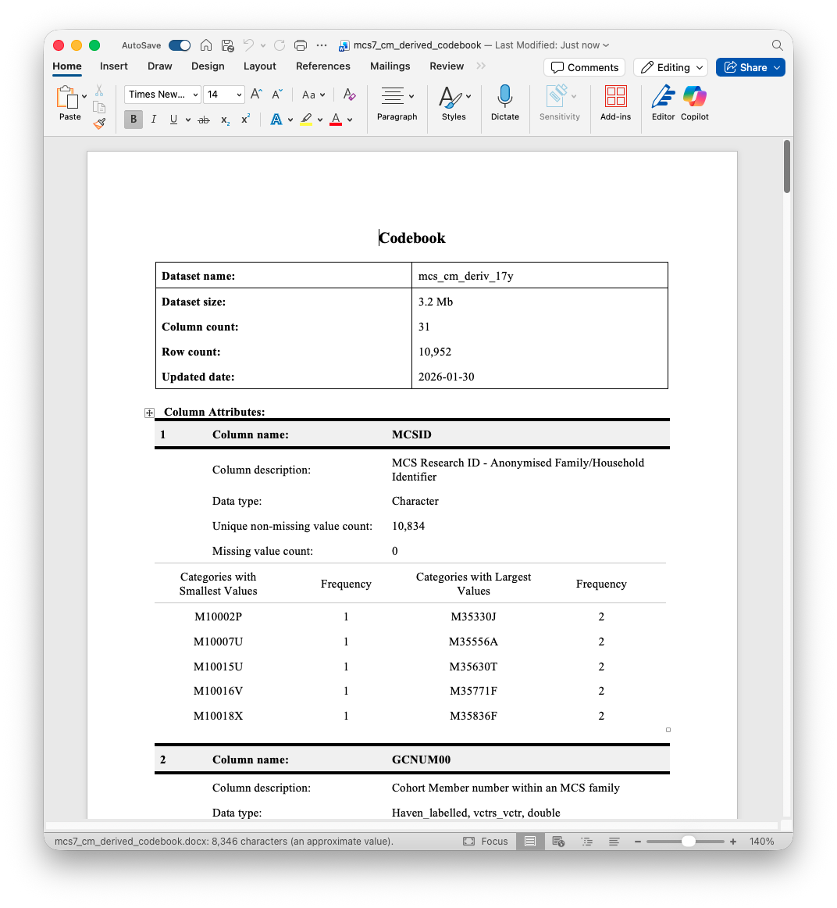

# Data Discovery  {#sec-data_discovery}

A *sine qua non* of longitudinal research is working out what variables are available in a given study, what their values indicate, and in which data files the variables are stored. This can be a surprisingly time-consuming process, but can be made more efficient using `R`. In this chapter, we will look at three packages for exploring data files: `codebookr`,`labelled` and `summarytools`. We will also look at `stringr` for working with character vectors.

The raw data are in Stata (`.dta`) format, so we will load them using the `read_dta()` function from the `haven` package. Let's load the `tidyverse` and `haven` packages, as well as `codebook`, `labelled`, `summarytools` and `glue`, the latter of which we'll use to construct file paths. Let's also load the cohort member derived variable dataset from Sweep 7 (17y) of the MCS:

```{r}
#| warning: false
#| message: false

library(tidyverse)
library(haven)
library(glue)
library(labelled)
library(codebookr)
library(summarytools)

mcs_fld <- Sys.getenv("mcs_fld")
ncds_fld <- Sys.getenv("ncds_fld")

mcs_cm_derived_17y <- glue("{mcs_fld}/17y/mcs7_cm_derived.dta") %>%
  read_dta()
```

## Creating Codebooks using `codebookr::codebook()`

We can start by creating a codebook using the `codebook()` function from `codebookr`. This is straightforward and involves two steps. First, creating the codebook as an `R` object. Second, saving the codebook as a Word (`.docx`) document. The `R` object isn't useful in itself. It is the `.docx` file that we will use.

```{r}
#| output: false
mcs_17y_codebook <- codebook(mcs_cm_derived_17y)
print(mcs_17y_codebook, "outputs/mcs7_cm_derived_codebook.docx")
```

Below is a screenshot of the results. You can open the generated Word document to view the full codebook.



The resulting `.docx` contains information on each variable including metadata such as variable labels, value labels, and basic descriptive statistics (e.g., mean, standard deviation, min, max, number of missing values). UKDS files typically come bundled with data dictionaries, but these can be limited (for instance, not including descriptive statistics), and so `codebookr` outputs can be better to work with.

There is some customisation possible within the `codebook()` function - see the help file (`?codebook`) for more information. Note, `codebook()` can take a while to run, especially for larger datasets.

### Task I

> Create a codebook for the NCDS Sweep 9 (55y) derived variable dataset (`55y/ncds_2013_derived.dta`). Identify variables related to the cohort member's weight.

```{r}
#| code-fold: true
#| code-summary: "Reveal the solution"
ncds_55y <- glue("{ncds_fld}/55y/ncds_2013_derived.dta") %>%
  read_dta()
ncds_55y_codebook <- codebook(ncds_55y)
print(ncds_55y_codebook, "outputs/ncds_55y_derived_codebook.docx")
```

## Searching Datasets with `labelled::lookfor()` 

An issue with the `codebook()` output is that, being outside `R`, one cannot search through it programmatically using `R` functions. The `lookfor()` function from the `labelled` package provides such functionality. `labelled` is not part of the `tidyverse`, but does follow its design philosophy.

`lookfor()` has a simple interface - you provide a `data.frame` (or `tibble`) and a search string or set of search strings. The function then identifies variables that match any of these strings, searching not just in the variable names, but also in variable and value labels. For instance, to find variables related to "overweight" in `mcs_cm_derived_17y`, we can enter the following:

```{r}
lookfor(mcs_cm_derived_17y, "overweight")
```

This function call returned information on four variables. By default, the search is not case-sensitive, behaviour that can be changed by setting the argument `ignore.case = FALSE`. The `labels` and `values` arguments can also be changed to exclude these metadata from the search. Note, calling `lookfor()` without specifying a search string will return information on all variables in the dataset.

Converting `lookfor()` output into a `tibble` (with `as_tibble()`) allows one to use `dplyr` functions to search the output further still. Here, we use the `str_detect()` function from `stringr` to keep only those rows that contain "IOTF" in the variable label:

```{r}
lookfor(mcs_cm_derived_17y, "overweight") %>%
  as_tibble() %>%
  filter(str_detect(label, "IOTF"))
```

You will notice this output returns two columns that are `lists` (the *list-columns* `levels` and `value_label`). We will return to list-columns later.

The `lookfor()` function uses *regular expressions* for search strings. Regular expressions are a compact way of specifying patterns in text. The syntax can be hard to remember as well as to read. Guides are available online, and ChatGPT can be especially helpful here. Nevertheless, the most useful rules are worth committing to memory because they get used a lot:

- The `^` and `$` symbols are used to anchor the start and the end of a string respectively. For instance, `^age` matches any string that starts with "age", while `age$` matches any string that ends with "age". `^age$` matches any string that is exactly "age".
- The `.` symbol matches any single character. For instance, `a.e` matches "age", "axe", "are", etc.
- The `*` symbol matches zero or more occurrences of the preceding character. For instance, `a*` matches "a", "aa", etc. The combination `.*` matches any sequence of characters (e.g., `a.*e` matches "ae", "ace", "apple", etc.).
- The `|` symbol is used for logical OR. For instance, `age|weight` matches any string that contains either "age" or "weight". Specified in parentheses, it can be used to group patterns (e.g., `(mother|father)_(education|age)` matches "mother_education", "father_age", "mother_age" and "father_education").
- The `\` symbol is used to escape special characters. A quirk of `R` is that you need to escape [special characters twice](https://r4ds.hadley.nz/regexps.html#sec-regexp-escaping). For instance, to match a literal dollar (`$`), you would use `\\$` in your regular expression.
- The `[]` symbols are used to specify a set of characters. `[0-9]` matches any digit, `[a-z]` matches any lowercase letter, `[A-Z]` matches any uppercase letter, and `[aeiou]` matches any lowercase vowel. The `[^]` syntax can be used to specify a set of characters to exclude. For instance, `[^0-9]` matches any character that is not a digit.
- The `\\d`, `\\s`, and `\\w` symbols are shorthand for digits, whitespace and 'word characters' (digits, letters, or underscores), respectively.

Regular expressions are also used within the `stringr` package. For instance, `str_detect(label, "IOTF")` above returned a logical vector equal `TRUE` where the variable label contained "IOTF".

Note, the `labelled` package also contains several helper functions for getting or setting attributes from `labelled` data. This includes:

- `var_labels()` to extract variable labels for a `tibble` or from a vector.
- `set_variable_labels()` to set variable labels for a `tibble`.
- `val_labels()` to extract value labels.

### Task II

> Find variables related to obesity or BMI in the `mcs_cm_derived_17y` dataset. Consider that the variable label may use related but different terms to these exact expressions.

```{r}
#| output: false
#| code-fold: true
#| code-summary: "Reveal the solution"
lookfor(mcs_cm_derived_17y, "obese|mass|bmi") # Multiple terms to capture variations
```

2. Open the NCDS Sweep 9 (55y) "flatfile" (`55y/ncds_2013_flatfile.dta`) and find variables related to weight or height.

```{r}
#| output: false
#| code-fold: true
#| code-summary: "Reveal the solution"
ncds_55y_flatfile <- glue("{ncds_fld}/55y/ncds_2013_flatfile.dta") %>%
  read_dta()
lookfor(ncds_55y_flatfile, "weight|height")
```

## Data Overviews with `summarytools::dfSummary()`

Another useful function for exploring datasets is `dfSummary()` from `summarytools` (not part of the `tidyverse`). This function provides a report on each variable in a dataset, like `codebook()` adding information on basic descriptive statistics, number of missing values, variable and value labels and so on. It also helpfully provided a histogram of values for each variable. The output can be viewed in the `R` console or alternatively in the `R` viewer pane by calling `stview()` on the `dfSummary()` output.

```{r}
#| output: false
# OUTPUT NOT SHOWN
mcs_17y_summary <- dfSummary(mcs_cm_derived_17y)
stview(mcs_17y_summary)
```

`dfSummary()` is useful alongside  `lookfor()` as it can help inform data cleaning. However `dfSummary()` is limited with labelled data because it does not display value labels for continuous variables (which can include values that are in fact missing codes; e.g., negative numbers). Several alternatives to `dfSummary()` exist which also have limitations with labelled data, including `skimr::skim()` and `dlookr::diagnose_web_report()`. `dplyr::count()` is very useful with labelled data as labels are presented within `tibble` printed outputs.

```{r}
mcs_cm_derived_17y %>%
  count(GCOBFLG7)
```

Given negative values (with few exceptions - e.g., income) are reserved for missing codes in the raw data, one way around this is to do some basic cleaning to replace negative values with `NA`. We did this in the last session using the `ifelse()` and `case_when()` functions. However, an issue is they do not retain metadata. Instead, we can use functionality from the `labelled` package. Below we create a function `negative_to_na()` which uses the `labelled::na_range()` and `labelled::user_na_to_na()`.

```{r}
#| output: false
# OUTPUT NOT SHOWN
negative_to_na <- function(x){
  na_range(x) <- c(-Inf, -1)
  user_na_to_na(x)
}

mcs_cm_derived_17y %>%
  mutate(bmi_cat_ifelse = ifelse(GCOBFLG7 >= 0, GCOBFLG7, NA),
         bmi_cat_cleaned = negative_to_na(GCOBFLG7)) %>%
  select(GCOBFLG7, bmi_cat_ifelse, bmi_cat_cleaned) %>%
  dfSummary() %>%
  stview()
```

In the next chapter, we will see how to apply the `negative_to_na()` function across multiple variables at once using `dplyr::across()`.

## Creating Comprehensive Data Dictionaries

So far, we have used `lookfor()` to find variables within a single dataset. However, in practice, we may wish to look across all datasets at once - e.g., to work out relevant files with a sweep or work out which sweeps a variable has been collected. So now let's create a comprehensive data dictionary combining all MCS data files using `lookfor()` with `map()`.

The first step is to create a set of file paths to files we will be calling `lookfor()` on. We can do this using the Base `R` function `list.files()`, putting this into a `tibble` where it will be easier to use. We specify the `pattern` argument to only return files with a `.dta` extension, and the `recursive = TRUE` argument to search through sub-directories, too.

```{r}
tibble(file = list.files(path = mcs_fld, 
                         pattern = "\\.dta$", 
                         recursive = TRUE))
```

Next, we can load the datasets and apply `lookfor()` to them. As noted, `map()` returns lists and `tibbles` can contain list-columns, so we can call `map()` within a `mutate()` call to create a new column of `lookfor()` results. To avoid unecessarily loading too much data, we can use the `n_max = 1` argument in `read_dta()` to just read the first row. We also set the argument `encoding = "latin1"` as `read_dta()` can sometimes fail without this. We also filter out any file paths from the "UKDS" subdirectory as these are repetitive of what we need: the [code](https://cls-data.github.io/docs/ncds-sweep_folders.html) to rearrange the data files makes a copy of each data file.

```{r}
mcs_data_dict <- tibble(path = list.files(path = mcs_fld,
                                          pattern = "\\.dta$",
                                          recursive = TRUE)) %>%
  filter(!str_detect(path, "^UKDS")) %>%
  mutate(
    ret = map(
      path, 
      ~ glue("{mcs_fld}/{.x}") %>%
        read_dta(n_max = 1, encoding = "latin1") %>%
        lookfor() %>%
        as_tibble()
    )
  )

mcs_data_dict
```

In its present form, the `mcs_data_dict` `tibble` is not easy to work with as each of the `lookfor()` outputs is nested within a row. `ret` is a list-column of `tibbles`, which is not a *tidy* format. We can use `tidyr::unnest()` to expand out the `ret` column so that, rather than having one row per file, we have one row per row in the `ret tibbles` (i.e., one row per variable).

```{r}
mcs_data_dict %>%
  unnest(ret)
```

The output is almost there. A few more improvements can be made:

-   The `path` column is not *tidy* because it arguably contains two variables: folder and file, which are separated by a forward slash (`/`). We can use `tidyr::separate()` to split these.
-   Values in the `label` columns are a mixture of upper and lower case, which makes them difficult to search with `str_detect()`. Converting these to lower case with `stringr::str_to_lower()` makes searching these easier. 
-   Values in the `variable` column are upper case, given the rubric used by MCS. To make searching easier, it is worth creating a new column to put this in lower case too.

```{r}
mcs_dict_clean <- mcs_data_dict %>%
  unnest(ret) %>%
  separate(path, into = c("fld", "file"), sep = "/") %>%
  mutate(variable_low = str_to_lower(variable),
         label_low = str_to_lower(label))
saveRDS(mcs_dict_clean, "outputs/mcs_data_dict.Rds")

mcs_dict_clean %>%
  filter(str_detect(label_low, "bmi|body"))
```

### Task III

> Find variables related to height and weight using `mcs_dict_clean`. In which sweeps was weight collected from MCS parents?

```{r}
#| output: false
#| code-fold: true
#| code-summary: "Reveal the solution"

mcs_dict_clean %>%
  filter(str_detect(label_low, "weight"),
         str_detect(file, "parent"))
```

> Create a data dictionary for all NCDS files. In which sweeps was information on diabetes collected?

```{r}
#| output: false
#| code-fold: true
#| code-summary: "Reveal the solution"

ncds_data_dict <- tibble(path = list.files(path = ncds_fld,
                                          pattern = "\\.dta$",
                                          recursive = TRUE)) %>%
  filter(!str_detect(path, "^UKDS")) %>%
  mutate(
    ret = map(
      path, 
      ~ glue("{ncds_fld}/{.x}") %>%
        read_dta(n_max = 1, encoding = "latin1") %>%
        lookfor() %>%
        as_tibble()
    )
  ) %>%
  unnest(ret) %>%
  separate(path, into = c("fld", "file"), sep = "/") %>%
  mutate(variable_low = str_to_lower(variable),
         label_low = str_to_lower(label))
saveRDS(ncds_data_dict, "outputs/ncds_data_dict.Rds")

ncds_data_dict %>%
  filter(str_detect(label_low, "diabetes")) # Only looked in variable label!
```


## Loading Data from Data Dictionaries

Given it contains information of file paths, the data dictionaries can be used to load specific variables. Here the key is to create a smaller `tibble` which has one row per file to be loaded and contains the information needed to construct a file path plus the vector of variables one wishes to import. To do this, we can use the `tidyr::chop()` function to collapse down multiple rows per file into a single row, with a list-column containing the variables to import.

```{r}
mcs_dict_clean %>%
  filter(str_detect(label_low, "iotf")) %>% 
  select(fld, file, variable) %>% 
  chop(variable)
```

Note, these variables aren't helpful on their own because they need to be loaded with identifier variables to make sure the data can be ascribed to an observational unit (e.g., a cohort member). In the next step, we load the data using `read_dta()`, specifying the `col_select` argument, including relevant identifier variables.

```{r}
load_from_dict <- function(fld, file, variables){
  glue("{mcs_fld}/{fld}/{file}") %>%
    read_dta(col_select = c("MCSID", matches("^.CNUM00$"), all_of(variables)))
}

mcs_dict_clean %>%
  filter(str_detect(label_low, "iotf")) %>% 
  select(fld, file, variable) %>% 
  chop(variable) %>%
  mutate(data = pmap(list(fld, file, variable), load_from_dict))
```

If we just wanted the data itself, we could have further called `... %>% select(file, data) %>% deframe()` to return a named list of datasets.

In the `col_select` argument we use two `tidyselect` helpers:

-   `matches()` finds variables which match a regular expression. (`XCNUM00` is used in each sweep to identify cohort members, with `X` a letter indicating sweep.)
-   `all_of()` selects all variables in a character vector.

We will return to `tidyselect` helpers in the next chapter.

### Task IV

> Adapt the `load_from_dict()` function to load NCDS variables related to height in the Age 55y sweep. `NCDSID` is the cohort member identifier in the NCDS. In some datasets, it is in upper case. In others, lower case. **Bonus:** try to make the function flexible enough that it can work with both MCS and NCDS data dictionaries.

```{r}
#| output: false
#| code-fold: true
#| code-summary: "Reveal the solution"

load_from_dict_v2 <- function(fld, file, variables, 
                                study_fld = ncds_fld,
                                id_regex = "NCDSID|ncdsid"){
  glue("{study_fld}/{fld}/{file}") %>%
    read_dta(col_select = c(matches(id_regex), all_of(variables)))
}

ncds_data_dict %>%
  filter(fld == "55y",
         str_detect(label_low, "height")) %>% 
  select(fld, file, variable) %>% 
  chop(variable) %>%
  mutate(data = pmap(list(fld, file, variable), load_from_dict_v2))
```
