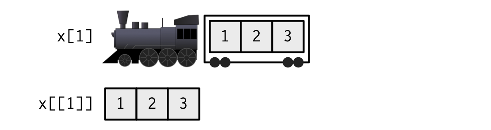

```{r}
#| label: setup
#| include: false
knitr::opts_chunk$set(
  warning = FALSE,
  message = FALSE,
  include = TRUE,
  echo = TRUE
)
```

## Instructions

1. Sign-up to UK Data Service
2. Download the MCS and NCDS data from the OneDrive link
3. Clone the GitHub repository with course materials

# Introduction to Course

## Characteristics of Longitudinal Data {.smaller}

-   Longitudinal data distinguished by effort involved in preparing data
    for analysis
-   Data split across multiple files
-   Metadata may vary across 'sweeps' and be lacking
-   Need to combine and reshape data for different stages of munging and
    analysis
-   Requirement to 'repeat one's self'

## Aims of Course

1.  Introduce `tidyverse` approach to coding in `R`
2.  Show how the `tidyverse` ecosystem can be used to identify
    variables, clean data, perform descriptive and inferential analyses,
    and present statistical outputs
3.  And demonstrate how this can be done **efficiently**

## Sessions {.smaller}

1.  Background to `R`
2.  Introduction to the `tidyverse`
3.  Data Discovery in `R`
4.  Efficient Data Munging using the `tidyverse`
5.  Producing and Presenting Descriptive Statistics
6.  Many Models and Post-estimation in `R`

-   This is a **coding** course, not a statistics course

## Running Example and Data {.smaller}

-  Associations between childhood cognitive ability and BMI
    -   Repeated measurement of BMI (growth curve modelling)
    -   Varied measurement of cognitive ability (many models)
-  Data from National Child Development Study and Millennium Cohort Study
    -   Changing metadata standards (NCDS; comfort exploring data)
    -   Consistent metadata standards (MCS; ripe for automation)
    -  Complex data structure (MCS; reshaping, collapsing, etc.)
    
## Things to Know

-   NCDS identifier is `NCDSID` or `ncdsid`
-   MCS identifier is `MCSID` & `XCNUM00` (where `X` a letter indicating sweep)
-   MCS data files are named consistently (`mcsx_[respondent]_[collection_type].dta`).
-   I am sharing the data with you to structure them in an [easier way](https://cls-data.github.io/docs/mcs-sweep_folders.html).

## House Rules

- Please ask questions at any point!

## Instructions

1. Sign-up to UK Data Service
2. Download the MCS and NCDS data from the OneDrive link
3. Clone the GitHub repository with course materials

- github.com/CLS-Data/r_longitudinal_data_analysis

# What is your experience with `R`?

# Background to `R`

# `R` Data Structures

## Data Structures

- `R` can hold many objects at once.
- Main data structures are vectors, lists, `data.frames`, and `tibbles`, the `tidyverse` version of `data.frames`.

## Vectors {.smaller}

-   Vectors are sets of values of the same atomic type.
-   `double`: Numbers with ability to store decimal places (e.g. `c(2.49, 1, 3/2)`)
-   `integer`: A round number. Denoted using `L` operator (e.g. `c(1L, 54L, 800L)`).
-   `character`: Strings, such as `"I said 'Hello'"` and `"My name is Liam"`.
-   `logical`: *Boolean* values `TRUE` or `FALSE`

## Vectors

- Type can be checked with `typeof()` or `is.type()` functions.

```{r}
typeof(1:3)
is.integer(1:3)
is.double(1:3)
is.numeric(1:3)
```

## Vectorisation and Recyling

-   `R` is a vectorised language
- Data of different types are coerced to the same type
-   Shorter vectors are recycled so that they are the same length.

```{r}
c(1, 2, 3, 4, 5) + c(2, 4, 6, 1, 2)
c(1, "two", TRUE)
c(1, 2, 3) + c(1, 3)
```

## Lists {.smaller}

- Collections of objects, potentially of different types and lengths.
- Lists can contain other lists, so can represent arbitrarily complex data structures.
- (I will call the objects in a list 'sub-objects')

```{r}
list(
  c(1, 2, 3),
  c("a", "b"),
  c(1, "two", TRUE), # Observe: coerced to a character vector
  list(1, "two", TRUE, c(4, 5, 6))
)
```

## `data.frames` {.smaller}

- Rectangular (spreadsheet-like) data structure with rows and columns.
- `data.frames` are in fact special types of list
    - Each column is a sub-object
    - Each row is a collection of values at the same position across the sub-objects
- Because they are lists, `data.frames` can contain columns that are lists (*list-columns*).

```{r}
head(iris)
```

# Subsetting

## Subsetting Vectors {.smaller}

- Subsetting is the process of extracting a subset of a data structure.
- Subsetting vectors be done using the `[ ]` operator after the vector name.
- Subsetting can be done with integers (position), logicals (`TRUE`/`FALSE`), or names (if the vector has names).

```{r}
ages <- c("Gary" = 10, "Bertie" = 20, "Peter" = 30)
ages[c(3, 2, 1, 1)]
ages[-2] # Drops a position
ages[c(TRUE, FALSE, TRUE)]
ages[c("Bertie", "Gary")]
```

## Subsetting Lists {.smaller}
- `[ ]` can also be used to subset lists. This creates a new list
- `[[ ]]` can be used to extract a
- `$` can also be used for extraction, and allows partial matching.

```{r}
my_list <- list(
  numbers = c(1, 2, 3),
  letters = c("a", "b", "c"),
  mixed = list(1, "two", TRUE)
)
my_list[2]
my_list[[2]] # Returns a vector
my_list$letters
my_list$lett
```

## Subsetting Lists 

```{r}
x <- list(1:3, 
          c("a", "b"))
```



## Subsetting `data.frames` {.smaller}

- Can be subsetting like `lists`
- `[ ]` returns a `da.frame` with specified columns
- `[[ ]]` and `$` extract a single column
- `[rows, columns]` subset specified rows and columns.
    - Leaving rows or columns blanks returns all rows or columns, respectively

```{r}
my_df <- data.frame(
  name = c("Gary", "Bertie", "Peter"),
  age = c(10, 20, 30),
  score = c(90, 85, 101),
  nationality = factor(c("English", "Scottish", "English"))
)
my_df[3:2, c("name", "score")]
```

## Subsetting `data.frames`

- Specifying `[, single_column]` returns a vector, not a `data.frame`
- This can produce unanticipated results so `tibbles` (`tidyverse`'s `data.frames`) do not do this.

```{r}
library(tibble)
my_tibble <- as_tibble(my_df)
my_df[, "age"] # Returns a vector
my_tibble[, "age"] # Returns a tibble
```

## Subsetting

- Subsetting operations can be strung together and are read left to right
- Subsetting is very important and used extensively
- A concrete example is to create *dictionaries*

```{r}
my_list[["mixed"]][[2]]
variable_dict <- c(age = "Age of Participant", score = "Test Score")
paste("The Average", variable_dict["score"], "is", mean(my_df$score))
```

# Creating Logical and Integer Vectors

## Creating Logical Vectors {.smaller}

- Logical and integer vectors are used for subsetting but aren't usually created by hand.
- Logical vectors are often created by comparing values in a vector to a condition.
    -   `==`: Equal to
    -   `!=`: Not equal to
    -   `<`: Less than
    -   `>`: Greater than
    -   `<=`: Less than or equal to
    -   `>=`: Greater than or equal to
    -   `%in%`: Element of (e.g., `ages %in% c(10, 30)`).
        -   Note this function is only vectorised on the left hand side.
    -   `between(x, lower, upper)`: `x >= lower` and `x <= upper`

## Creating Logical Vectors

```{r}
ages[ages == 25]
ages[ages >= 20]
ages[ages %in% c(10, 30)]
```

## Creating Logical Vectors {.smaller}

- Logical vectors can be combined using the following operators:
    -  `&`: Logical AND (e.g., `ages >= 20 & ages <= 30`)
    -   `|`: Logical OR (e.g., `ages < 15 | ages > 25`)
    -   `!`: Logical NOT (e.g., `!(ages >= 20 & ages <= 30)`)
- Conditions are read left to right but can be overridden using parentheses.
    
```{r}
ages[ages >= 20 & ages <= 30]
ages[ages < 15 | ages > 25]
ages[!(ages >= 20 & ages <= 30)]
ages[ages >= 28 | (ages <= 23 & ages != 20)]
```

## `R`'s Missing Value, `NA`

- Missing values are denoted by `NA` in `R`
- These are (almonst always) treated literally as 'unknown'
    - Logical comparisons with `NA` return `NA`
    - *Think: is an unknown value greater than 5? Well, that is unknown!*
- Exception to this is `%in%` operator which searches for `NA`'s.

## `R`'s Missing Value, `NA` {.smaller}

- Missing values can be dropped using `na.omit()`
- `is.na()` can be used to identify `NA` values
- In MCS and NCDS data, negative values typically indicate missingness
- An essential cleaning step is to convert these to `NA`.

```{r}
ages_na <- c(ages, Dave = NA)
ages_na > 20
ages_na[ages_na > 20]
ages_na[na.omit(ages_na > 20)] # Omits NAs
ages_na[ages_na %in% c(10, NA)]
```

## Creating Integer Vectors {.smaller}

-   `which(logical_vector)`: Returns the indices where the logical vector equals `TRUE`.
-   `match(vector, table)`: Returns a vector of the positions of (first) matches of a `vector` in another. The function returns `NA` for non-matches.
-   `seq(from, to, by)`: Generates a sequence of numbers from `from` to `to`, incrementing by `by`.

```{r}
which(ages >= 20)
match(ages, c(30, 10, 40))
seq(0, 10, by = 2)
```

## Task I

1. Subset the `my_list` object above to create a new list that contains only the third and first elements (in that order) of the `letters` sub-object.
2. Get the name and age of the person with the highest score in `my_df`.

## Task I Solutions

1. Subset the `my_list` object above to create a new list that contains only the third and first elements (in that order) of the `letters` sub-object.

```{r}
my_list$letters[c(3, 1)]
```

## Task I Solutions

2.  Get the name and age of the person with the highest score in `my_df`.

```{r}
my_df[my_df$score == max(my_df$score), c("name", "age")]
```

# Attributes and Generic Functions

## Attributes {.smaller}

- Objects in `R` can have attributes, - metadata about the object.
- `names` is one attribute we have used already, which we specified with `key=value` pairs when creating objects.
- Other common attributes include `class` (which enable more complex data structures that the atomic types) and `levels` (which defines the categories of a factor variable).
    - `data.frames` are in fact lists with the `data.frame` class
    - `factors` are in fact integers with the `factor` class and a `levels` attribute
    
```{r}
typeof(my_df)
class(my_df)
typeof(my_df$nationality)
class(my_df$nationality)
```

## Attributes {.smaller}

- Attributes can be gotten (and set) with `attributes(object)` and `attr(object, "attribute_name")` functions
- Widely-used attributes have their own get and set functions too.

```{r}
attributes(my_df)
names(my_df)
class(my_df)
levels(my_df$nationality)
dim(my_df)
```


